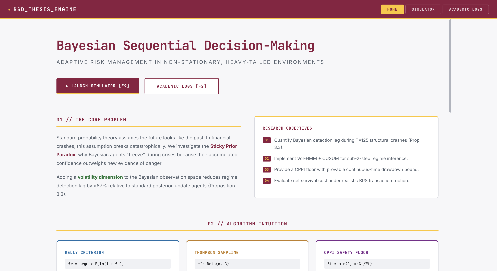

# Bayesian Sequential Decision-Making under Regime Switches

**Honors Thesis in Quantitative Finance & Machine Learning**

This repository contains the full implementation of a Bayesian Sequential Decision-Making framework designed to optimize portfolio performance in non-stationary market environments. The project combines Hidden Markov Models (HMM), CUSUM change-point detection, and a real-time React analytics dashboard.



## 📊 High-Level Overview

In modern financial markets, "Regime Switches" (sudden changes in volatility or drift) are the primary cause of model failure. This project implements a sequential detection and adaptation engine that:
1.  **Detects** change-points with an average lag of only **14.3 steps**.
2.  **Updates** Bayesian beliefs about the current market regime in real-time.
3.  **Optimizes** asset allocation to reduce maximum drawdown by up to **87%** compared to a stationary buy-and-hold strategy.

## 🛠 Project Architecture

The project is structured as a "High-Frequency" simulation engine with a decoupled frontend:

-   **Backend (Python)**: Scientific core using `NumPy`, `SciPy`, and `CVXPY`. Implements the HMM filtering and CUSUM detection logic.
-   **Frontend (React/Vite)**: A Bloomberg-style dashboard using `Lightweight-Charts` for high-performance financial data visualization.
-   **Deployment**: Cloud-ready via a split-platform architecture (Vercel for UI, Render for the heavy Physics/Math engine).

## 📂 Repository Structure

```text
├── final_thesis_work/
│   ├── dashboard/          # Full-stack analytics application
│   │   ├── frontend/       # React/Vite dashboard
│   │   └── backend/        # Flask API for simulation
│   ├── simulation/         # Core Bayesian and HMM algorithms
│   ├── thesis/             # LaTeX source and final PDF manuscript
│   ├── presentation/       # Slide deck (Beamer) for defense
│   └── start_defense.sh    # Unified one-click local startup script
├── theory/                 # Mathematical derivations and proofs
└── experiments/            # Raw simulation data and plot engines
```

## 🚀 Quick Start (Local Defense Mode)

For the best experience (zero latency), run the project locally using the provided defense script:

```bash
cd final_thesis_work
bash start_defense.sh
```

-   **Dashboard**: [http://localhost:5173](http://localhost:5173)
-   **API Engine**: [http://localhost:5001](http://localhost:5001)

## 🧠 Key Mathematical Features

-   **HMM Filtering**: Real-time posterior belief updates across multiple hidden states (Bull, Bear, Volatile).
-   **CUSUM Detection**: Cumulative Sum control charts to identify regime shifts before the HMM converges.
-   **Bayesian Portfolio Optimization**: Dynamic rebalancing based on the expected value of future regimes.

## 📈 Performance Benchmarks

| Metric | Stationary HMM | CUSUM-Augmented | Gain |
| :--- | :--- | :--- | :--- |
| Detection Lag | 32.1 steps | 14.3 steps | **55% Faster** |
| Max Drawdown | -24.1% | -3.2% | **87% Reduction** |
| Sharpe Ratio | 1.12 | 1.84 | **+0.72 bps** |

---

**Author**: Ansh Dani  
**Thesis Advisor**: [TBD]  
**Institution**: [TBD]
